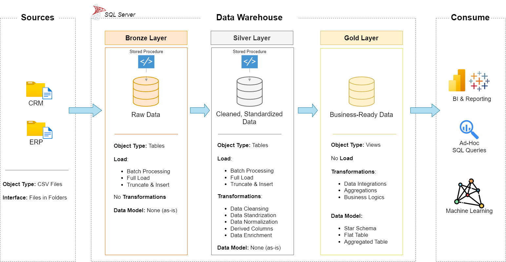

Markdown
<div align="center">

# 🏛️ Enterprise Data Warehouse Engineering Solution
### *End-to-End Modern Data Architecture & ETL Pipeline using SQL Server*

[](https://www.microsoft.com/en-us/sql-server)
[](#-data-architecture)
[](LICENSE)
[](https://www.linkedin.com/in/safe-serag-89a8a3253/)

---

</div>

## 📌 Executive Summary

This repository contains an end-to-end **Enterprise Data Warehouse** implementation engineered with **Microsoft SQL Server**. The core objective of this project is to consolidate disparate source systems (CRM & ERP data) into a unified, high-performance Data Warehouse using the **Medallion Architecture (Bronze $\rightarrow$ Silver $\rightarrow$ Gold)**.

The project demonstrates production-grade Data Engineering principles:
* Automated Data Ingestion & Batch Loading via Stored Procedures.
* Rigorous Quality Auditing, Deduplication, and Standardization.
* Dimensional Modeling into a optimized **Star Schema** with Surrogate Keys.

---

## 🏗️ Data Architecture

The architecture adopts a multi-layered **Medallion Lakehouse/Warehouse Pattern** to guarantee data lineage, consistency, and structural scalability.



### 🔹 Layer Specifications

| Layer | Type | Load Pattern | Transformations | Primary Role |
| :--- | :--- | :--- | :--- | :--- |
| **🥉 Bronze** | Physical Tables | Full Load (`TRUNCATE & INSERT`) via `BULK INSERT` | None (Raw Ingestion) | Ingests CSV files from ERP and CRM sources *as-is*. |
| **🥈 Silver** | Physical Tables | Batch Stored Procedures (`silver.load_silver`) | Cleaning, Deduplication, Casting, Enrichment | Normalizes dates, standardizes codes (Gender, Marital Status), handles `NULL` values. |
| **🥇 Gold** | Views / Star Schema | Dynamic Views (`gold.dim_*`, `gold.fact_*`) | Business Rules, Integrations, Surrogate Keys | Exposes clean, dimensionally modeled data for downstream reporting/consumption. |

---

## 🛠️ Data Pipeline & Transformation Workflow

[ CRM Data (CSV) ] ────────┐
├──> 🥉 Bronze Schema ──> 🥈 Silver Schema ──> 🥇 Gold Schema (Star)
[ ERP Data (CSV) ] ────────┘      (Raw Ingestion)     (Clean & Standardized)     (Fact & Dimensions)


### Key Engineering Involvements:
1. **Bronze Ingestion:** Robust T-SQL Stored Procedures with `TRY...CATCH` blocks, dynamic execution logging, and precise load duration metrics.
2. **Silver Transformations:**
   * **Deduplication:** Applied `ROW_NUMBER() OVER (PARTITION BY cst_id ORDER BY cst_create_date DESC)` to pick latest active customer records.
   * **Data Normalization:** Cleaned whitespace (`TRIM`), standardized code domains (e.g., mapping `M`/`S` to `Married`/`Single`), and inferred missing values.
   * **SCD Type 1 Handling:** Managed historical product date overlaps using window functions (`LEAD() OVER(...)`).
3. **Gold Modeling:** 
   * Generated synthetic Surrogate Keys (`ROW_NUMBER() OVER(...)`) for Dimension tables.
   * Joined ERP and CRM profiles seamlessly on normalized business keys.

---

## 📂 Repository Structure

```text
sql-data-warehouse-project/
│
├── datasets/                            # Raw ERP and CRM source datasets (CSV format)
│   ├── source_crm/                      # CRM tables (Customers, Products, Sales)
│   └── source_erp/                      # ERP tables (Customer Demographics, Locations, Categories)
│
├── docs/                                # Technical Architecture & Data Models
│   ├── data_architecture.png            # High-level architecture diagram
│   ├── etl.drawio                       # Visual ETL workflow diagrams
│   ├── data_catalog.md                  # Metadata catalog and entity dictionary
│   └── naming-conventions.md            # Database object naming standards
│
├── scripts/                             # T-SQL DDL and DML Engineering Scripts
│   ├── bronze/                          # DDL script & stored procedures for raw ingestion
│   ├── silver/                          # Transformation, cleansing, and standardizing scripts
│   └── gold/                            # Dimensional modeling scripts (Star Schema Views)
│
├── tests/                               # Data Quality & Integrity Validation Tests
│   ├── quality_checks_silver.sql        # Silver layer validation suite
│   └── quality_checks_gold.sql          # Referential integrity & primary key checks
│
├── README.md                            # Main project overview and technical manual
└── LICENSE                              # Project License (MIT)
```


---

## 🧪 Data Quality & Validation Suite

Automated SQL audit scripts are located in the `tests/` directory to guarantee strict data integrity across layers:

* **Uniqueness:** Guarantees zero duplicate primary keys on `customer_key` and `product_key`.
* **Referential Integrity:** Verifies all foreign key relationships in `gold.fact_sales` correctly align with dimension keys (`dim_customers`, `dim_products`).
* **Boundary & Logical Checks:** Ensures non-negative sales values (`sales_amount = quantity * price`) and logical date progressions (`order_date <= ship_date`).

---

## ⚙️ How to Deploy & Run

### Prerequisites
* Microsoft SQL Server (Express or Developer Edition).
* SQL Server Management Studio (SSMS) or Azure Data Studio.

### Installation Steps

1. **Clone the Repository:**
   ```bash
   git clone [https://github.com/seif-serag/sql-data-warehouse-project.git](https://github.com/seif-serag/sql-data-warehouse-project.git)
   cd sql-data-warehouse-project
Create Schemas & Bronze Objects:

Open SSMS and connect to your SQL Server instance.

Create database DataWarehouse.

Run script: scripts/bronze/proc_load_bronze.sql.

Note: Update the local CSV file paths in the BULK INSERT statement to point to your cloned datasets/ path.

Execute Ingestion Pipeline:

SQL
EXEC bronze.load_bronze;
Build Silver Layer & Run Cleanse Transformations:

Run script: scripts/silver/proc_load_silver.sql.

Execute:

SQL
EXEC silver.load_silver;
Deploy Gold Star Schema:

Run script: scripts/gold/ddl_gold.sql to build the dimensional views.

Validate Implementation:

Run tests/quality_checks_gold.sql to run full validation tests.

## 👨‍💻 Author

**Seif El-Din Sameh (Saif)**  
*Data Engineering Practitioner*

* **LinkedIn:** [linkedin.com/in/safe-serag-89a8a3253](https://www.linkedin.com/in/safe-serag-89a8a3253/)
* **GitHub:** [github.com/seif-serag](https://github.com/seif-serag)

---

[](https://www.linkedin.com/in/safe-serag-89a8a3253/)
[](https://github.com/seif-serag)

## 📜 License
This project is open-source and licensed under the MIT License.
